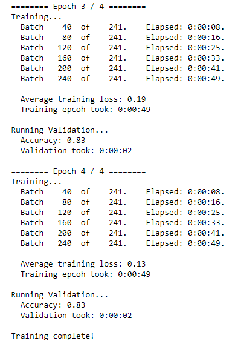
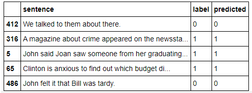

# Fine Tuning BERT for Sentence Classification

#### Introduction

In this notebook we will use BERT  to quickly and efficiently fine-tune a model to get near state of the art performance in sentence classification.

We will use BERT to train a text classifier. Specifically, we will take the pre-trained BERT model, add an untrained layer of neurons on the end, and train the new model for our classification task. 

#### Advantages of Fine-Tuning

1. **Quicker Development**
   - First, the pre-trained BERT model weights already encode a lot of information about our language. As a result, it takes much less time to train our fine-tuned model - it is as if we have already trained the bottom layers of our network extensively and only need to gently tune them while using their output as features for our classification task. In fact, the authors recommend only 2-4 epochs of training for fine-tuning BERT on a specific NLP task (compared to the hundreds of GPU hours needed to train the original BERT model or a LSTM from scratch!).
2. **Less Data**
   - In addition and perhaps just as important, because of the pre-trained weights this method allows us to fine-tune our task on a much smaller dataset than would be required in a model that is built from scratch. A major drawback of NLP models built from scratch is that we often need a prohibitively large dataset in order to train our network to reasonable accuracy, meaning a lot of time and energy had to be put into dataset creation. By fine-tuning BERT, we are now able to get away with training a model to good performance on a much smaller amount of training data.
3. **Better Results**
   - Finally, this simple fine-tuning procedure (typically adding one fully-connected layer on top of BERT and training for a few epochs) was shown to achieve state of the art results with minimal task-specific adjustments for a wide variety of tasks: classification, language inference, semantic similarity, question answering, etc. Rather than implementing custom and sometimes-obscure architectures shown to work well on a specific task, simply fine-tuning BERT is shown to be a better (or at least equal) alternative.

#### Training Logs

#### Sample Results

Refer to complete solution [here](https://github.com/krishnarevi/Sentence_Classification_BERT/blob/main/BERT_Fine_Tuning_Sentence_Classification.ipynb) 
